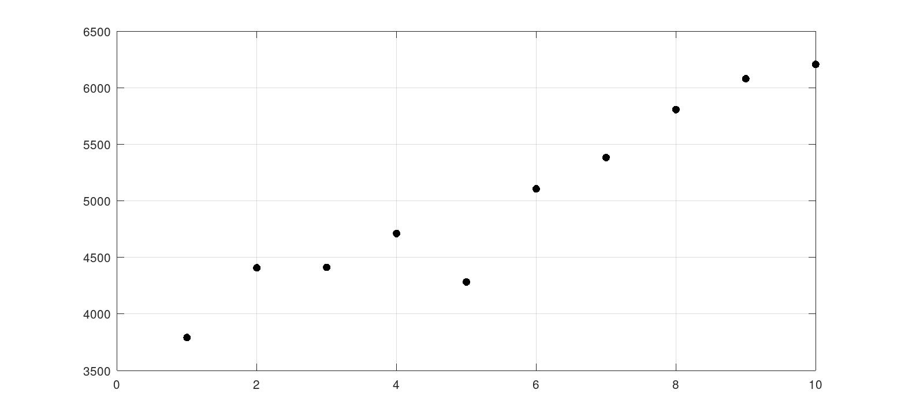
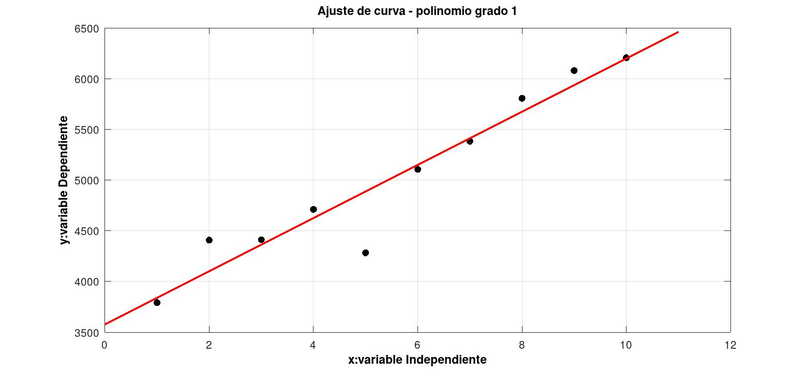
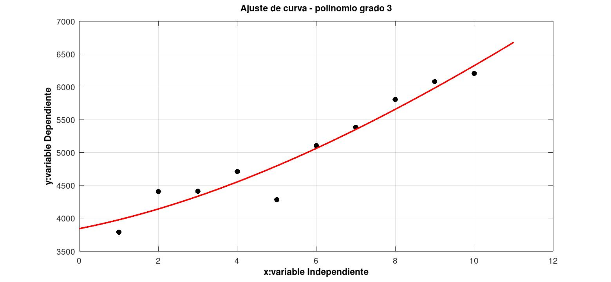
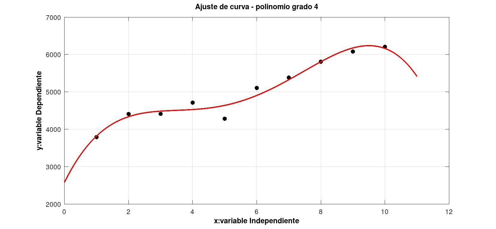
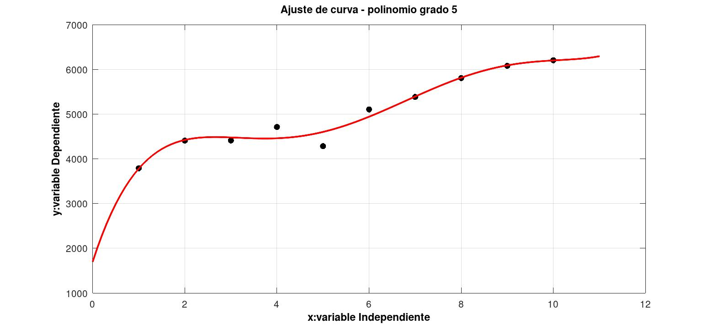

# Ajuste de Curvas con mínimos cuadrados
Consideremos la siguiente tabla que representa la cotización del dólar (ti)  en el tiempo (ci) :

| Tiempo (ti) | Cotización del dólar (ci) |
| ----------------- | ----------------------------- |
| 1 | 3790.81   |
| 2 |  4407.51  |
| 3 |  4412.01 |
| 4 |  4711.73 |
| 5 |  4283.17  |
| 6 | 5105.71   |
| 7 | 5383.11  |
| 8 |  5807.58  |
| 9 | 6079.87  |
|10 |  6205.98  |

Luego si graficamos los pares (ti ,ci ) que disponemos en los datos, formamos el siguiente diagrama de dispersión:

  

En base a estos datos nos interesa encontrar una función c(t) con la que podeamos calcular una estimativa de la cotización del dolar para un tiempo cualquiera, para un polinomio de grado n el polinomio será\\

  c(t) = a0 + a1t + a2t2 + ... + antn

Ajustando los puntos a un polinomio de grado 1

  

Ajustando los puntos a un polinomio de grado 2

  

Ajustando los puntos a un polinomio de grado 3

  

Ajustando los puntos a un polinomio de grado 4

  

Ajustando los puntos a un polinomio de grado 5

  

