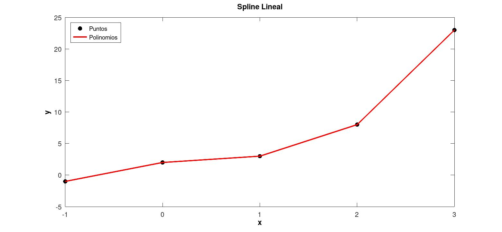
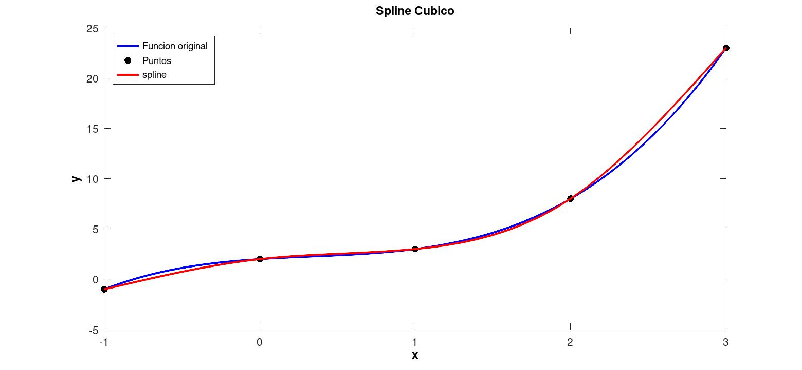

# Splines Interpolantes
Consiste en usar una función por partes, cuyas partes son justamente polinomios interpolantes de grado menor .Esta función por partes deberia de tener características deseables, como continuidad y difereciabilidad.

**Ejemplo 1** Sea \( f(x) = x3 -x2 + x +2 \) halle una spline cúbica que interpole los siguientes puntos

|  xk|f(xk)|
| ----------------- | ----------------------------- |
| -1 | -1   |
| 0 |  2  |
| 1 |  3 |
| 2 |  8 |
| 3 |  23  |

Spline Lineal

  

Spline Cubico

  

